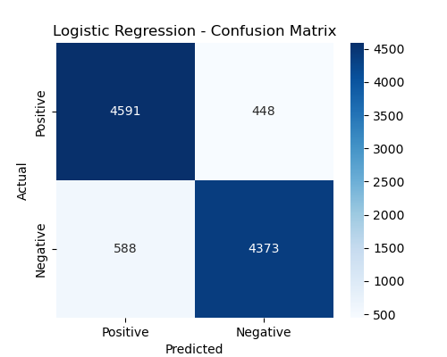

# 🎬 Sentiment Analysis on IMDb Reviews

This project classifies IMDb movie reviews as **positive** or **negative** using Natural Language Processing (NLP) techniques.

## 📌 Overview
- Dataset: **50,000 IMDb reviews** (balanced positive & negative)
- Preprocessing: lowercase, remove punctuation, remove stopwords
- Feature Extraction: **TF-IDF Vectorization**
- Models:
  - Logistic Regression
  - Naive Bayes
- Visualizations:
  - WordClouds for positive & negative reviews
  - Confusion Matrices for each model
  - Accuracy comparison charts

## 📂 Dataset
The dataset is **too large to upload** to GitHub.  
You can download it from Kaggle here:  
[📥 IMDb Dataset of 50K Movie Reviews](https://www.kaggle.com/datasets/lakshmi25npathi/imdb-dataset-of-50k-movie-reviews)  

After downloading:
1. Extract the ZIP file.
2. Place the file `IMDB Dataset.csv` in the same folder as the notebook.

## 📊 Results
| Model               | Accuracy |
|---------------------|----------|
| Logistic Regression | ~89.6%   |
| Naive Bayes         | ~86.9%   |

## 📦 Libraries Used
- pandas
- numpy
- matplotlib
- seaborn
- scikit-learn
- nltk
- wordcloud
- re (regex)

## ▶ How to Run
1. Install dependencies:
   ```bash
   pip install pandas numpy matplotlib seaborn scikit-learn nltk wordcloud
   ```
2. Download the dataset from Kaggle (link above).
3. Place `IMDB Dataset.csv` in the same folder as the notebook.
4. Run `Sentiment_Analysis_IMDb.ipynb` in Jupyter Notebook.

## 📷 Visualizations
  
  
  
  

---

**Author:** Heba  
**LinkedIn:** [Click Here](https://www.linkedin.com/in/hebatuallah-abdelhamed-2860b625a/)
